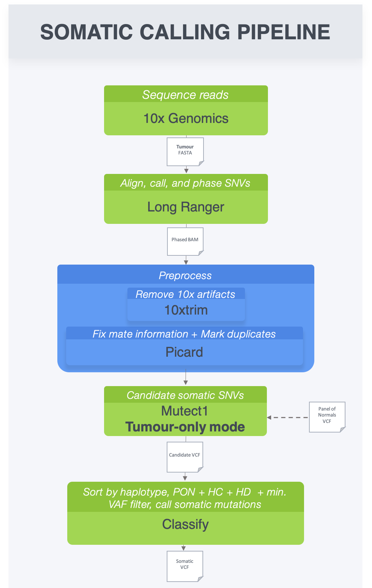

# 10xtrim

Program for trimming 10x-specific artifacts.

## Dependencies

* A compiler that supports C++11
* htslib

## Installation Instructions
You can download and compile the latest code from github as follows:

```
git clone --recursive https://github.com/jopineda/10xtrim.git
cd 10xtrim
make
```

## Workflow Examples
{ width=25% }<!-- .element height="50%" width="50%" -->

### Data preprocessing

```
# mark duplicates
java -jar [path-to-picard-tools]/MarkDuplicates.jar\
    I=phased.bam \
    O=phased.marked_dups.bam\
    M=phased.marked_dups.metrics.txt"

# index bam
samtools index phased.marked_dups.bam
```

### Generate new BAM with additional softclip
```
./10xtrim -b phased.marked_dups.bam -o trimmed.stats | samtools view -Sbh | samtools sort > phased.marked_dups.trimmed.sorted.bam
```

### Data postprocessing
```
# fix mates
java -jar [path-to-picard-tools]/FixMateInformation.jar\
    I=phased.marked_dups.trimmed.sorted.bam\
    O=phased.marked_dups.trimmed.fixmates.bam

# sort
samtools sort phased.marked_dups.trimmed.fixmates.bam > phased.marked_dups.trimmed.fixmates.sorted.bam
samtools index phased.marked_dups.trimmmed.fixmates.sorted.bam
```
