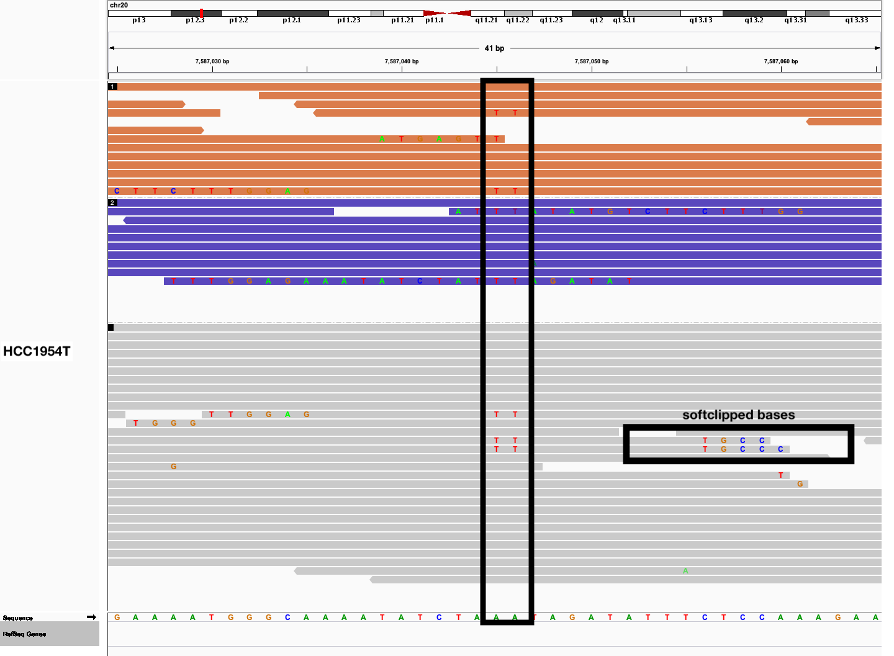

# Quickstart - how to trim 10X-specific artifacts

The original purpose of 10xtrim was to improve the *tumour-only* somatic mutation calling accuracy when using 10X Genomics' linked-reads. Here we provide a step-by-step tutorial to help you get started.

# PART 1: trim inverted repeat reads

**Requirements**:

* `10xtrim`
* [`samtools`](https://htslib.org)


**Example dataset**:

* Sample: HCC1954 (Human cell line derived from a primary stage IIA, grade 3 invasive ductal carcinoma) 
* Instrument : Illumina X Ten
* Region: "chr20:7586000-7588000"
* Reference: hg19
* [Tumour phased BAM](https://support.10xgenomics.com/genome-exome/datasets/2.1.0/HCC1954T_WGS_210)
* [Normal phased BAM](https://support.10xgenomics.com/genome-exome/datasets/2.1.0/HCC1954N_WGS_210)

This is a subset of phased reads aligned to a 2kb region of hg19 reference genome. 

You should find the following files in `data/`:

* ``tumour.phased.md.sorted.bam`` : tumour read alignments to reference
* ``tumour.phased.md.sorted.bam.bai`` : tumour read alignments index
<!--* ``normal.phased.md.sorted.bam`` : tumour read alignments to reference
* ``highconf.hg19.bed`` : high confidence intervals from GIAB
* ``cosmic.hg19.vcf`` : known somatic mutations from COSMIC
* ``dbsnp.hg19.vcf``  : known common variants from dbSNP
-->

## Motivation
------------------------------------------------------------------------

In this tutorial, we aim to remove a 10X-specific false positive (FP) variant when calling in tumour-only mode. 
Here, we define a 10X-specific artifact as a variant NOT found when calling somatc mutations in matched tumour-normal mode.

The FP multinucleotide variant (MNV) we are removing looks like this:



This MNV has many softclipped bases on the evidence reads, which present chimeric signatures.

For example for the evidence read with this sequence:

```
TCATAGGCCTGCTTGCCATTTATATGTCTTCTTTGGAGAAATATCTA*TT*TAGATATTTCTCCAAAGAAGACATATAAATGGCAAGCAGGCCTATGAAAAGGTGCTCAACGTTATTAATCATAGGAGAAAAGCAAATCCCCAAACTACAATG
```
The FP variant is denoted by the surrounding asterisks.

The subsections of the chimera map to nearby locations in the genome. As seen in this BLAT result:

```
   ACTIONS      QUERY   SCORE START   END QSIZE IDENTITY  CHROM           STRAND  START       END   SPAN
--------------------------------------------------------------------------------------------------------
browser details YourSeq   109    39   151   151    98.3%  chr20           +     7587036   7587148    113
browser details YourSeq    58     1    58   151   100.0%  chr20           -     7587036   7587093     58
```

And show this inverted repeat signature, that can form self-overlaps. As seen in this mfold result:

```
          10        20        30        40
.-T|                                            A
   CATAGGCCTGCTTGCCATTTATATGTCTTCTTTGGAGAAATATCT T
   GTATCCGGACGAACGGTAAATATACAGAAGAAACCTCTTTATAGA T
\ -^                                            T
       90        80        70        60        50
 
```

We use 10xtrim to identify these reads, and further softclip these reads to remove these 10X-specific artifacts.

## Pre-processing steps (already done)

**Marking duplicates, again**

We recommend an additional round of marking duplicates. LongRanger provides the phased BAM file and carries out a barcode-aware markng of duplicates. Reads with missing backcodes may not be missed.

This step can occur before or after 10xtrim.

In the interest of time, we already carried out mark duplicates with the following commands on Picard:

```
# mark duplicates
java -jar [path-to-picard-tools]/MarkDuplicates.jar\
    I=tumour.phased.sorted.bam \
    O=tumour.phased.md.sorted.bam\
    M=tumour.phased.md.metrics.txt"

# index bam
samtools index tumour.phased.md.sorted.bam
```

**Identifying false positives**

To identify FP, we ran MuTect1 in matched tumour-normal mode. 

A FP in this case is a variant found tumour-only mode, but not found in matched tumour-normal mode.
 
The following parameters were used:

```
java -jar /u/jpineda/tools/mutect-src/mutect/target/mutect-1.1.7.jar\
     -T MuTect -L chr20\
     -R refdata-hg19-2.1.0/fasta/genome.fa\
     -I:tumor tumour.phased.md.sorted.bam\
     -N:normal normal.phased.md.sorted.bam\
     --vcf tumour_normal.md.vcf\
     -o tumour_normal.md.out\
     --cosmic data/cosmic.hg19.vcf\
     --dbsnp data/dbsnp_138.hg19.vcf\
     --tumor_sample_name HCC1954T\
     --normal_sample_name HCC1954N\
     --normal_panel pon.hg19.mutect1.siteonly.vcf
```

**Filtering variants**

To filter variants, we highly recommend using a panel of normal, high confidence filter (from GIAB), our haplotype discordant filter, and a minimum allele frequency cut off of 0.06. This can be run using our custom script `filter.py`.

```
python filter.py tumour_normal.md.vcf data/tumour.phased.md.sorted.bam shared-data/highconf.hg19.bed HCC1954T
``` 

The output is a filterd VCF file: `tumour_normal.md.filtered.vcf`.

### Compute a trimmed modified BAM file
------------------------------------------------------------------------

Let's get started! First we will trim the BAM file and then sort the alignments:

```
# specific to OICR cluster
module load picard
module load samtools

# run 10xtrim
./10xtrim -b tumour.phased.md.sorted.bam -o tumour.trimmed.stats | samtools view -Sbh | samtools sort > tumour.phased.md.trimmed.sorted.bam
samtools index tumour.phased.md.trimmed.sorted.bam
```

### Visualize difference in IGV:

To see how 10xtrim removed this 10X-specific artifact we can visualize the false positive in IGV with the BAMs pre and post 10xtrim. In the interest of time, I've generated the IGV screenshot of what we should expect:


# PART 2: calling somatic mutations

**Additional requirements**:

* [`picard`](https://github.com/broadinstitute/picard)
* `python 2.7`
* [`MuTect1`](https://github.com/broadinstitute/mutect)

We should find MuTect and picard jar files in `tools/`.

**External files**:

We will be using external data files for filtering and denoting the variants.

You should find the following files in `shared-data/`:
* ``highconf.hg19.chr20.bed`` : high confidence intervals from GIAB
* ``cosmic.hg19.chr20.vcf`` : known somatic mutations from COSMIC
* ``dbsnp.hg19.chr20.vcf``  : known common variants from dbSNP

## Post-processing steps for downstream analyses:

To carry out downstream analyses, we need to fix any mate pairs where 10xtrim completely unmaps an alignment. This may cause inconsistent BAM records.

We can use Picard's Fixmateinformation:

```
java -jar tools/picard/FixMateInformation.jar\
    I=tumour.phased.md.trimmed.sorted.bam\
    O=tumour.phased.md.trimmed.fixmates.bam

samtools sort tumour.phased.md.trimmed.fixmates.bam > tumour.phased.md.fixmates.sorted.bam
samtools index tumour.phased.md.trimmed.fixmates.sorted.bam
```

## Call somatic mutations in tumour-only mode:
------------------------------------------------------------------------

We can now call our somatic mutations using MuTect1 in tumour-only mode:

```
java -jar tools/mutect-src/mutect/target/mutect-1.1.7.jar\
     -T MuTect -L chr20\
     -R refdata-hg19-2.1.0/fasta/genome.fa\
     -I:tumor tumour.phased.md.trimmed.fixmates.sorted.bam\
     --vcf tumour_only.md.trimmed.fixmates.vcf\
     -o tumour_only.md.trimmed.fixmates.out
     --cosmic shared-data/cosmic.hg19.chr20.vcf\
     --dbsnp shared-data/dbsnp_138.hg19.chr20.vcf\
     --tumor_sample_name HCC1954T\
     --normal_sample_name HCC1954N\
     --normal_panel shared-data/pon.hg19.mutect1.siteonly.vcf
```

**Filter variants**

To filter variants, we highly recommend using a panel of normal, high confidence filter (from GIAB), our haplotype disc
ordant filter, and a minimum allele frequency cut off of 0.06. This can be run using our custom script `filter.py`.

```
module load python 
source venv/bin/activate
python filter.py tumour_only.md.trimmed.fixmates.vcf tumour.phased.md.trimmed.fixmates.sorted.bam shared-data/highconf.hg19.bed HCC1954T
```
